# E-Commerce Flask Application

This is a simple e-commerce web application built using Flask and MongoDB. The application displays products with details such as name, tag, price, and image, fetched dynamically from a MongoDB Atlas database.

## Features
- Displays a homepage with background image, navbar, and footer
- Dynamic products page with product details fetched from MongoDB.
- Responsive UI using Bootstrap for styling.

## Screenshots

Here are some screenshots of the application:

### Code

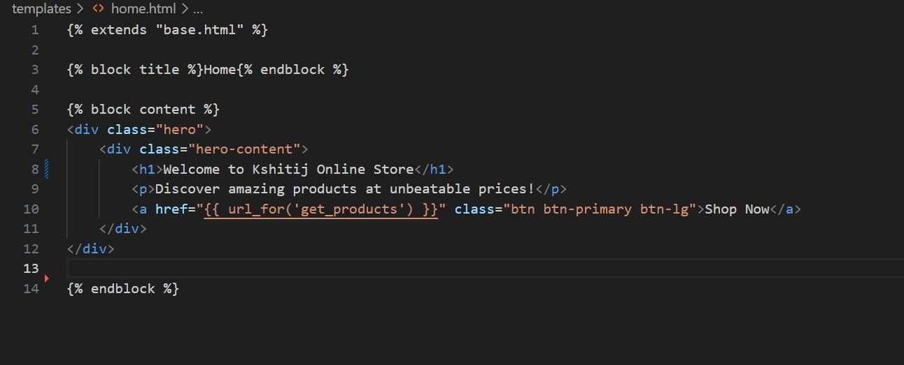

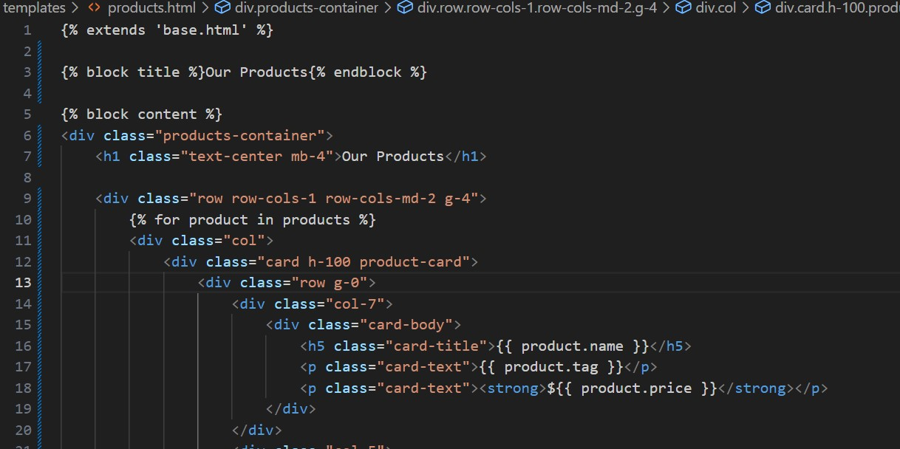

### Home Page

### Products Page

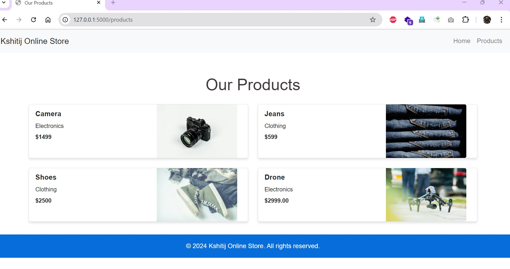

  
## Installation

Follow these steps to set up the project locally:

1. **Clone the repository**:

`git clone https://github.com/your-username/ecommerce-flask-app.git`

2. Navigate to the project directory:
   
`cd ecommerce-flask-app`

4. Install the required dependencies:
   
`pip install -r requirements.txt`

6. Set up your MongoDB Atlas cluster and create a .env file with your connection string:

 `MONGO_URI=your_mongo_uri_here`

8. Run the application:

`python app.py`

10. Open your browser and go to http://127.0.0.1:5000/.

# Running Tests
In this project, we have implemented three unit tests for a Flask application that interacts with a MongoDB database. The tests cover different aspects of the application, ensuring reliable performance and correct database operations.

1. Test 1: Route Test
Purpose:
This test verifies the behavior of one of the application’s routes. The test checks the response status code when an invalid request method is used. For example, if the /products route only accepts GET requests, the test sends a POST request to the route and expects a 405 Method Not Allowed status code.

Integration with CI/CD:
The test uses the Flask test client to simulate HTTP requests. In the GitHub Actions workflow, this test runs automatically with every code change, ensuring that incorrect request methods are handled properly.

2. Test 2: Database Read Operation
Purpose:
This test checks if the application can successfully connect to MongoDB and perform a read operation. It sends a ping command to verify that the MongoDB client is connected correctly.

Integration with CI/CD:
The MongoDB read test runs in the CI/CD pipeline using environment variables for credentials. The GitHub Actions workflow loads these environment variables securely and runs the test to ensure the MongoDB connection is functional before deploying the application.

3. Test 3: Database Write Operation
Purpose:
This test validates the write operation to the MongoDB database. It attempts to insert a sample document into the products collection and then queries the database to check if the document was inserted successfully. The test uses assertions to verify the presence of the inserted data.

Integration with CI/CD:
The write test is part of the automated testing process in GitHub Actions. The pipeline runs the test to ensure that the application can interact with the database and perform write operations correctly. This step helps prevent issues with data insertion before merging changes into the main branch.

## Steps to Run Tests Locally
1. Ensure you have installed all dependencies:
`pip install -r requirements.txt`

2. Set up MongoDB credentials as environment variables:
`export MONGODB_URI="your_mongo_uri_"`
`export MONGODB_USERNAME="your_mongodb_username"`
`export MONGODB_PASSWORD="your_mongodb_password"`

3. Run the tests using pytest:
`pytest tests/`

4. Once you run the tests, you should see the following output in your terminal. Here is an example of the test results after running `pytest`:
## Test Complete
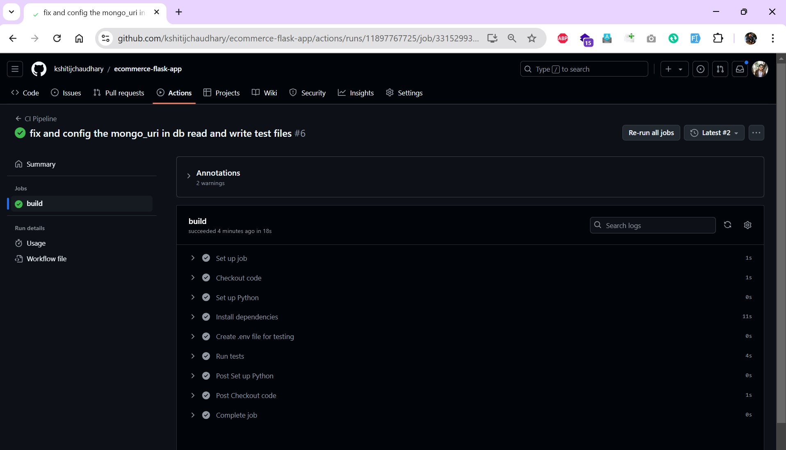

# Screenshots of Passed Tests in Code Editor
## Test Routes
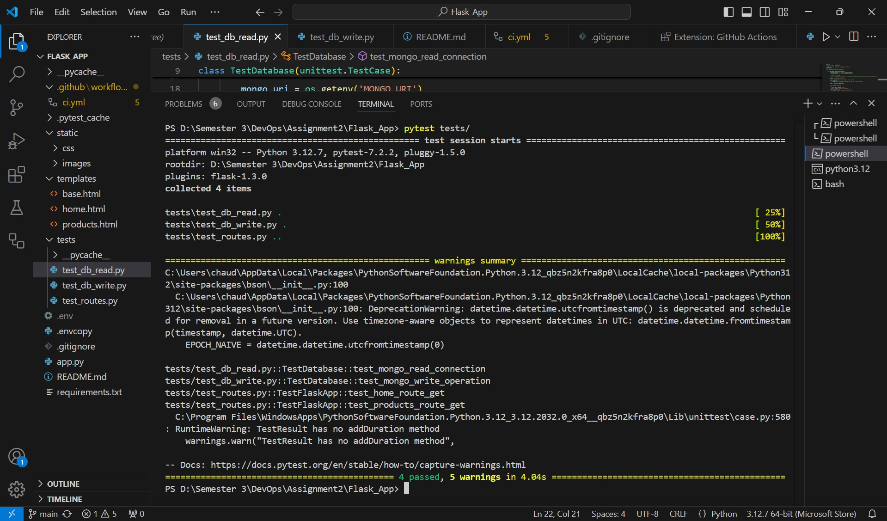

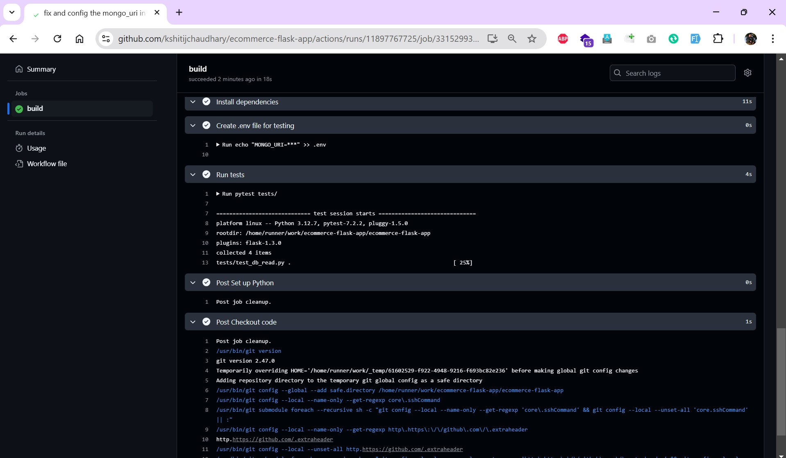

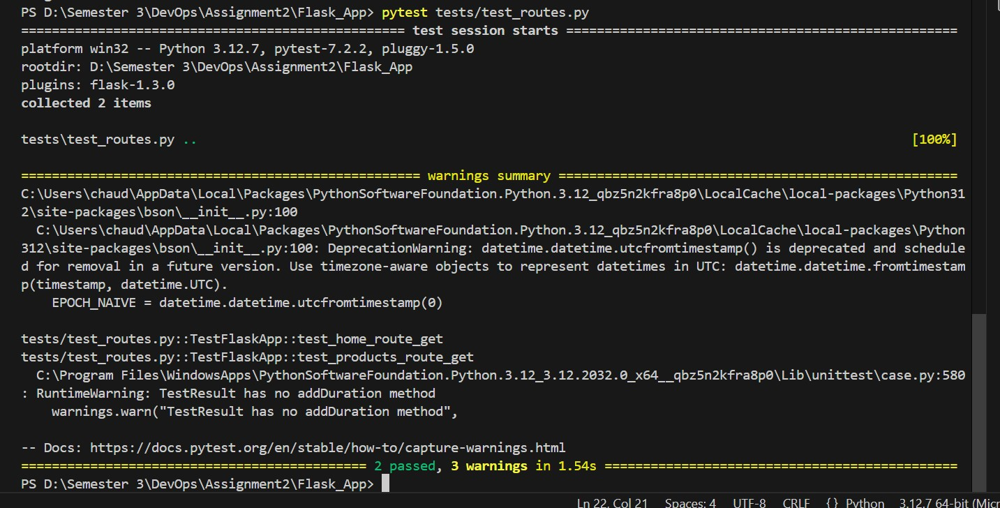

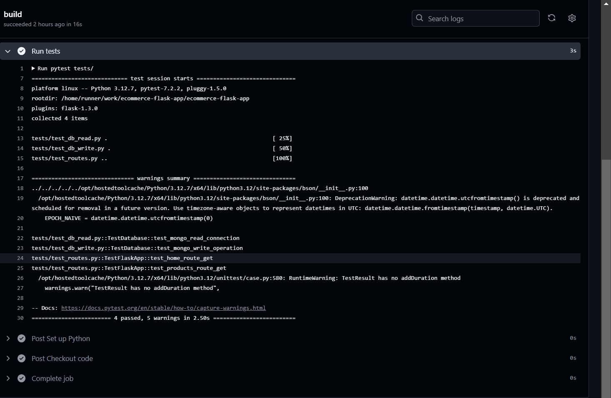

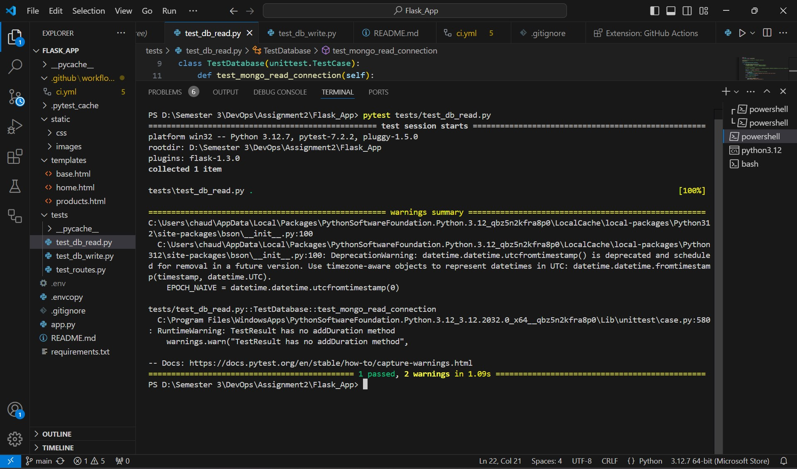
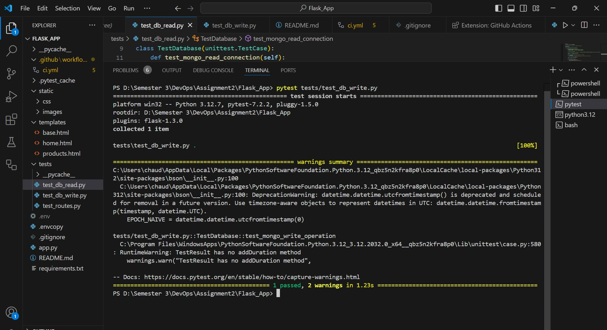

## Test Items added
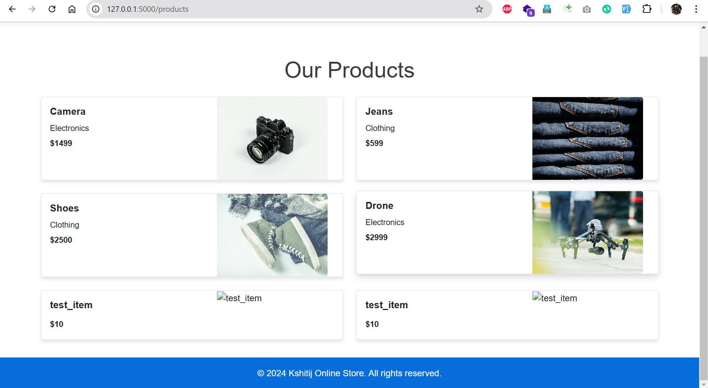

## Network provided to all IPS
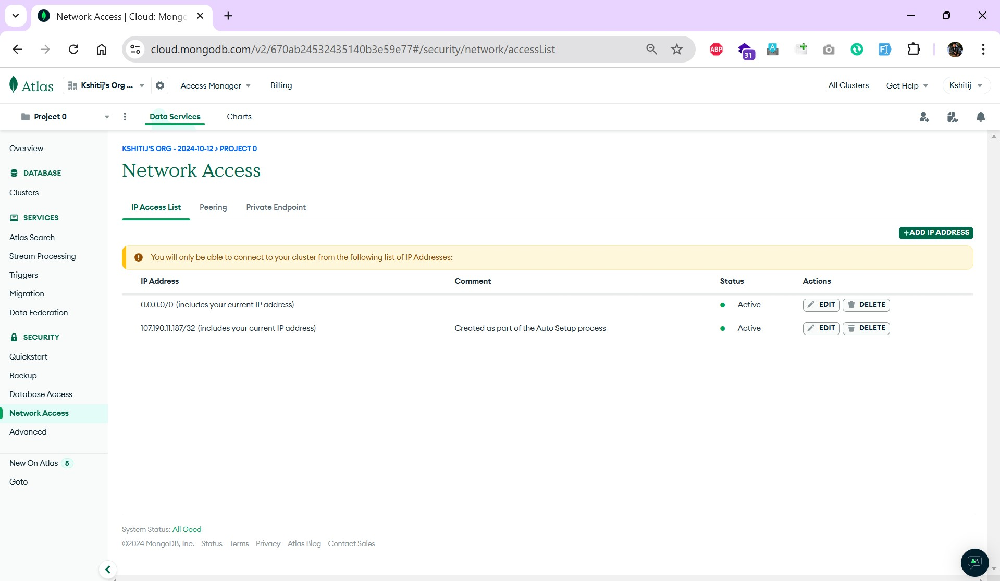

